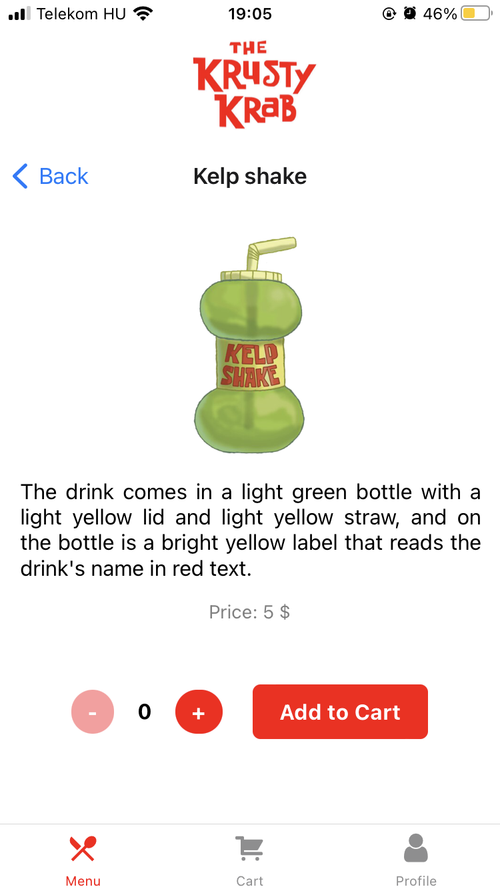
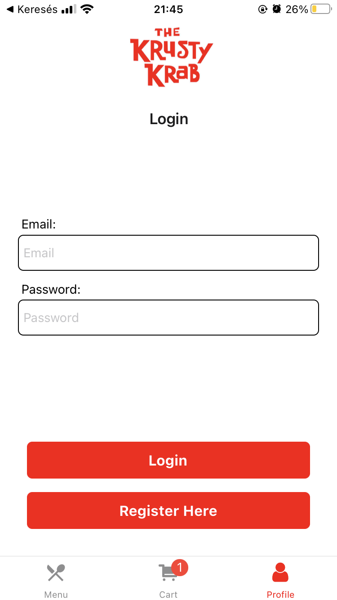

# Krusty Krab mobile app

## Installation and Setup Instructions

Clone this repo

```
git clone https://github.com/Uni-Sopron/mobil-22O-kebelei-krusty-krab.git
cd web1-21o-kebeleicsaba
```

Copy `.env.template` to `.env` and fill in the data in `.env`

And run

```bash
yarn install
expo start
```

<details>
<summary>Screenshots</summary>

<p align="center">
Menu screen
</p>
<p align="center">



</p>

<p align="center">
Cart screen
</p>
<p align="center">


</p>

<p align="center">
Check out
</p>
<p align="center">


</p>

<p align="center">
User screen
</p>
<p align="center">



</p>

<p align="center">
Order details
</p>
<p align="center">


</p>

</details>
